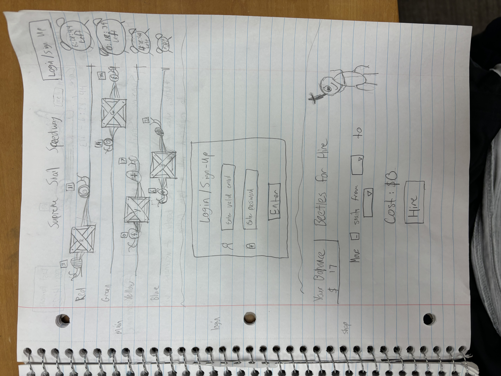
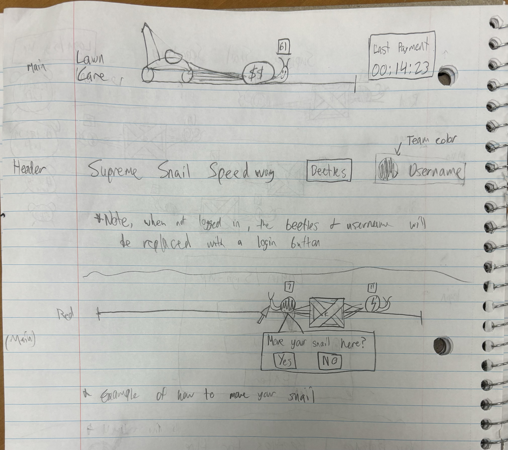

# Supreme Snail Speedway

## Specification Deliverable

### Elevator Pitch

Snail racing is the next big thing. With this snail racing application, you will be collaborating with your teammates from around the world to have your snails pull your team's crate to the end first. These races tend to take *hours*, so the opportunity is yours to swing the odds in your favor! With this application, you will be able to watch the race in real time and take action to put your team in front. 

[Full Concept](early-concept/idea.md)

### Design

### Key features
- Display of current snail race standings
- Collaboration with fellow users in a competitive setting
- Poses users with strategic decisions to try and best help their team
- Ability to interact with the webpage and participate in the game
- Secure login over HTTPS
- Data is persistently stored 

### Technologies

The required technologies will be implemented in the following ways:

- **HTML** - Three HTML Pages. One for login, one for showing the race, and one for hiring beetles. Links between pages at the top of the screen.
- **CSS** - Styling for the webpage to make it look presentable. 
- **JavaScript** - Allow for interactive elements that allow users to log in, move their snail, and hire beetles.
- **Service** - Backend will handle things such as:
  - Calculating at what time each team will finish
  - Validating user requests to move snails or hire beetles
  - Updating the database to carry out user requests
  - Pulling from the database to show users the current state of the race
- **DB/Login** - Will store user's credentials, including their balance, as well as the number of snails in each position, and the distance each team has left in the race.
- **WebSocket** - Each client will be regularly updated with the current state of the race.
- **React** - The HTML, CSS, and Javascript will be ported to and wrapped up in React.

## HTML
The application is structured using HTML:

  - **Pages** - There are 5 pages. index (home page), login, signup, speedway, and shop.
  - **Links** - The home page contains links to both the login and sign-up pages. The login and sign-up pages link to each other, and take you to speedway upon form submission. Both speedway and shop contain links to each other, as well as the home page.
  - **Text** - Many elements are text, such as the team names, amount of snails, time left, the quote, etc.
  - **Images** - The header includes an image of a snail on a track. 
  - **DB/Login** - There in an input box for username/email and password that will authenticate from the database. The number of snails on each team, the time left for each team, as well as each users balance, is all stored in the database.
  - **WebSocket** - The amount of snails in the race as well as the time remaining for each snail will be regularly updated as users changes influence the race.
  - **3rd Party Service** - At the bottom of the raceway is an inspirational quote pulled from a 3rd party service, similar to Simon.

## CSS
  The application is styled using CSS (and mostly Bootstrap).
  - **Header, footer, and main content body** - All styled to presentabilty.
  - **Navigation elements** - Styled with Bootstrap's navbar presets.
  - **Responsive to window resizing** - Still doesn't look great on mobile-sized devices :/
  - **Application elements** - Spaced and colored aesthetically.
  - **Application text content** - Properly spaced and consistent font. 
  - **Application images** - Racing snail featured in the header.

